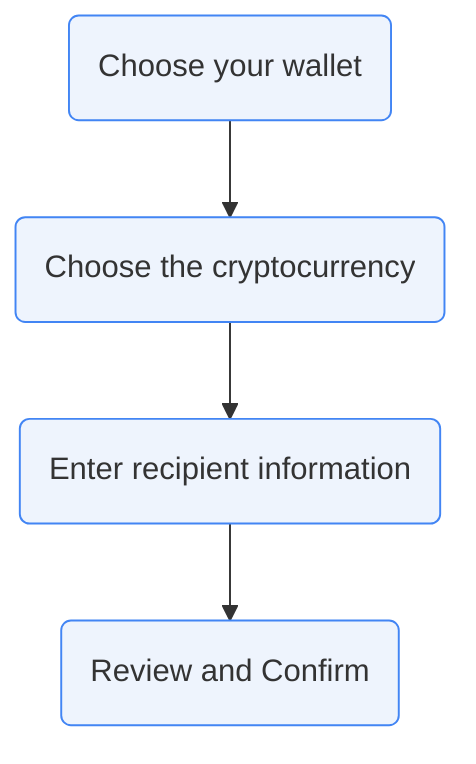

# Sending

## How to transfer funds?

### 1. Choose your wallet

The first step is to choose a wallet from which funds is sent out.
We support the following three wallets:

> * [Drive Wallet](/wallet)
> * [Metamask](https://metamask.io/)
> * [Ledger](https://www.ledger.com/)

Click on the wallet you want to use and proceed to the next step. 
If you are using a hardware wallet, make sure to keep your device plugged in.

### 2. Choose the cryptocurrency

Click on the type of cryptocurrency you want to send in the coin list, and follow the instruction on the page.

### 3. Enter recipient information

We autofill the sender email. You only need to provide the following:

> * Recipient Email
> * Amount
> * Security Answer (self-provided or auto-generated)

### 4. Review and confirm

Please double check the details with your recipient, such as recipient's email address, amount and security answer, and make sure they're correct before confirming your transfer. The transaction fee is also estimated and shown on the review page.

Click the "Confirm and Transfer" button to continue, and follow the instruction at the bottom of the page.

Once it is completed, a receipt is shown. Be sure to copy the security answer and send it to your recipient.

## How long does a transfer take?

A single transfer involves two cryptocurrency transactions, one for sending and one for receiving.

The two main factors influencing the transaction time are:
    1. The amount of network activity
    2. Transaction fees

Chainsfr automatically chooses the median of transaction fees from the last several blocks, assuming a typical daily transaction volume, the average time it takes to complete one transaction is

> * 15 seconds for ETH, DAI and other ERC20 tokens (1 confirmation)
> * 60 minutes for BTC (6 confirmations)

In short, 15 seconds for sending out ETH, DAI and other ERC20 tokens, 15 seconds for receiving.
60 minutes for sending out BTC, and another 60 minutes for receiving. 

## How do you notify me about my transfer?

We will contact you by email when your transfer is created, when your recipient received your funds, and when the transfer expires.

## How do you determine your fees?

The transfer service is free of charge. You only pay for [transaction fees](https://en.wikipedia.org/wiki/Cryptocurrency#Transaction_fees). The average fee per transaction is listed below:

> * ~ 0.04 USD for ETH, DAI and other ERC-20 tokens
> * ~ 1 USD for BTC

## Can I send funds to someone with only their email address?

Yes! All you have to do is enter their email address and set a security answer, and we will send them an email with instructions on how to accept the transfer.

## What if I enter my recipient's email wrong? 

We encrypt your transfer data with the security answer provided. Only the one having the correct security answer and the corresponding transfer email link is able
to receive the funds. The transfer expires after 30 days if not claimed by the recipient. To cancel the transfer, see [Cancellation Section](/cancelling) for details.

## Can I make repeat transfers?

It is not supported currently. Let us know if you think this feature is useful.

## What currencies do you support?

> * ETH
> * DAI
> * BTC

More will be added to the list in the future.

## Are there transfer limits?

None.
